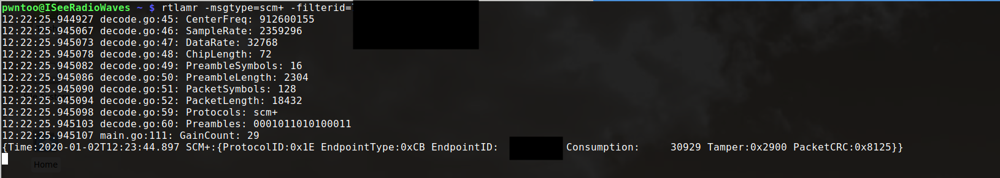
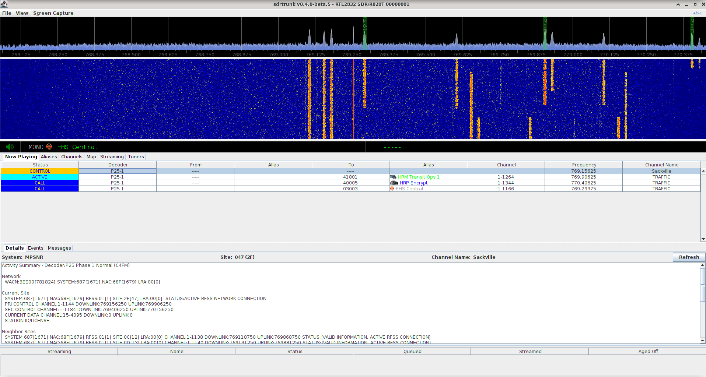
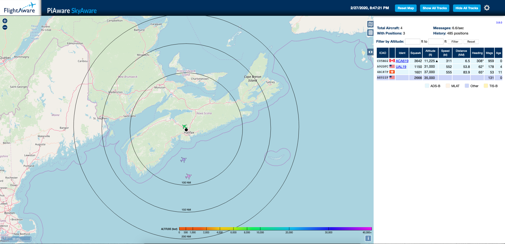
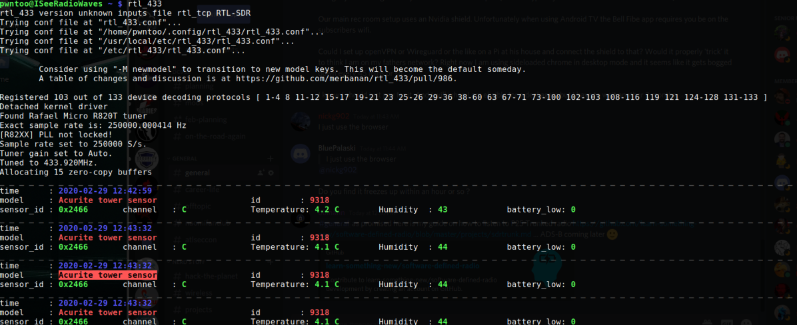
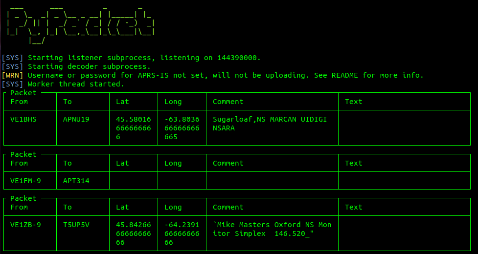

# Software Defined Radio

## Uses

**[Monitor your water meter](projects/water-meter.md)**

**[Listen to local ambulance and fire (Digital Trunked Radio)](projects/sdrtrunk.md)**

**Watch air traffic overhead (ADS-B)**

**Rerad temperature sensors**

**Decode packet radio (APRS)**   

### Other Examples
- [External] [Reverse Engineer Resturant Pagers](https://www.rtl-sdr.com/using-a-hackrf-to-reverse-engineer-and-control-restaurant-pagers/)
- [External] [Build an IMSI Catcher](https://harrisonsand.com/imsi-catcher/)

## Hardware

### Receivers

**[Nooelec NESDR SMArt](https://www.nooelec.com/store/sdr/sdr-receivers/nesdr-smart-sdr.html)**

- 25 MHz - 1.75 GHz
- Aluminum Housing

**[Nooelec NESDR SMArTee](https://www.nooelec.com/store/sdr/sdr-receivers/nesdr-smart-sdr.html)**

- 25 MHz - 1.75 GHz
- Aluminum Housing
- 4.5V USB Powered Bias Tee

**[NooElec NESDR Smart XTR](https://www.nooelec.com/store/nesdr-smart-xtr.html)**

- 65 MHz - 2.3 GHz (small frequency gap near 1.1 GHz)
- Aluminum Housing

**[Generic DVD-B+DAB+FM SDR](https://www.amazon.ca/RTL-SDR-DVB-T-Stick-RTL2832U-R820T/dp/B00D3X9LR4)**

- 25 MHz - 1.75 GHz

**[RTL-SDR Blog SDR](https://www.rtl-sdr.com/buy-rtl-sdr-dvb-t-dongles/)**

- 500 kHz to 1.75 GHz
- Aluminum Housing
- HF Direct Sampling from 500 kHz to 24MHz
- Software Controlled 4.5V USB Powered Bias Tee

**[FlightAware Pro Stick](https://flightaware.com/adsb/prostick/)**

- 25 MHz - 1.75 GHz
- On board RF Amplifier

**[FlightAware Pro Stick Plus](https://flightaware.com/adsb/prostick/)**

- 25 MHz - 1.75 GHz
- On board RF Amplifier
- On board 1090MHz Filter

### Transceivers

**[Great Scott Gadgets HackRF](https://greatscottgadgets.com/hackrf/)**

- 1 MHz to 6 GHz
- Half Duplex
- USB 2

**[Great Scott Gadgets Yard Stick One](https://greatscottgadgets.com/yardstickone/)**

- Sub 1GHz
- Half Duplex
- USB 2

**[LimeSDR Mini](https://limemicro.com/products/boards/limesdr-mini/)**

- 10 MHz - 3.5 GHz
- Full Duplex
- USB 3.0

### Filters

**Low-Noise Amplifier (LNA)**
Reduce the noise figure and increase SNR for a specific frequency or range.

Examples:

- ADS-B: Amplifies the 1090 MHz frequency to improve ADS-B reception
- Wideband: A general purpose LNA often in the 20MHz-4000MHz range
- GEOS: Center frequency of 1688 MHz for NOAA

**Bandstop Filter**  
Reduces noise by removing frequencies frequencies in a specific range.

Examples:

- Broadcast FM - Reduces noise by removing frequencies frequencies in the 88 MHz to 108 MHz range (Broadcast FM)
- Broadcast AM - Reduces noise by removing frequencies in the 525 kHz to 1.705 MHz range (broadcast AM)

## Software

### General

- GQRX - SDR Receiver
- Spektrum - Spectrum Analyzer
- Universal Radio Hacker (URH) - analyze wireless protocols
- rfcat
- [freqwatch](https://github.com/covertcodes/freqwatch) - frequency counter / logger
- Inspectrum - analize offline signals
- DSpectrumGUI
- [ham2mon](https://github.com/madengr/ham2mon) - HAM Radio monitor

### Single Purpose

- [Dump1090-fa](https://github.com/flightaware/dump1090) - ADS-B
- [SDRtrunk](https://github.com/DSheirer/sdrtrunk) - Monitor digital trunked radio
- [multimon-ng](https://github.com/EliasOenal/multimon-ng/) - decode pagers
- Spectrum Painter - Troll the radio waves
- Ooktools - On-off keying tools
- [rtlamr](https://github.com/bemasher/rtlamr) - Smart Meter data receiver
- [rtl_433](https://github.com/merbanan/rtl_433) - ISM band data receiver
- [PyPacket](https://github.com/mike01/pypacker) - APRS I-Gate
- [direwolf](https://github.com/wb2osz/direwolf) - APRS packet modem
- [Xastir](https://github.com/Xastir/Xastir) - APRS Mapping

### Utilities

- rtl_tcp
- [hackrf_tcp](https://github.com/jpenalbae/hackrf_tcp) - rtl_tcp implementation for hackrf
- [SoapySDR](https://github.com/pothosware/SoapySDR) - Vendor neutral SDR library

## License

This tool is protected by the GNU General Public License v2.
