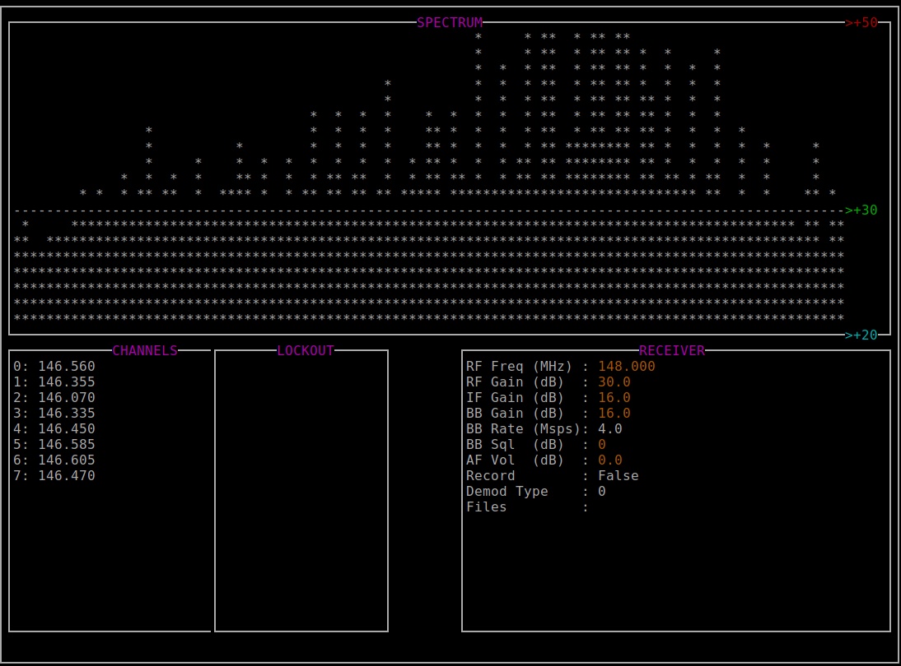

# Software Defined Radio

## Uses

**[Monitor your water meter](projects/water-meter.md)**

**[Listen to local ambulance and fire (Digital Trunked Radio)](projects/sdrtrunk.md)**

**Watch air traffic overhead (ADS-B)**

**Rerad temperature sensors**

**Decode packet radio (APRS)**   

**Find amature radio broadcasts**   

### Other Examples
- [External] [Reverse Engineer Resturant Pagers](https://www.rtl-sdr.com/using-a-hackrf-to-reverse-engineer-and-control-restaurant-pagers/)
- [External] [Build an IMSI Catcher](https://harrisonsand.com/imsi-catcher/)

## Hardware

### Receivers

**[Nooelec NESDR SMArt](https://www.nooelec.com/store/sdr/sdr-receivers/nesdr-smart-sdr.html)**

- 25 MHz - 1.75 GHz
- Aluminum Housing

**[Nooelec NESDR SMArTee](https://www.nooelec.com/store/sdr/sdr-receivers/nesdr-smart-sdr.html)**

- 25 MHz - 1.75 GHz
- Aluminum Housing
- 4.5V USB Powered Bias Tee

**[NooElec NESDR Smart XTR](https://www.nooelec.com/store/nesdr-smart-xtr.html)**

- 65 MHz - 2.3 GHz (small frequency gap near 1.1 GHz)
- Aluminum Housing

**[Generic DVD-B+DAB+FM SDR](https://www.amazon.ca/RTL-SDR-DVB-T-Stick-RTL2832U-R820T/dp/B00D3X9LR4)**

- 25 MHz - 1.75 GHz

**[RTL-SDR Blog SDR](https://www.rtl-sdr.com/buy-rtl-sdr-dvb-t-dongles/)**

- 500 kHz to 1.75 GHz
- Aluminum Housing
- HF Direct Sampling from 500 kHz to 24MHz
- Software Controlled 4.5V USB Powered Bias Tee

**[FlightAware Pro Stick](https://flightaware.com/adsb/prostick/)**

- 25 MHz - 1.75 GHz
- On board RF Amplifier

**[FlightAware Pro Stick Plus](https://flightaware.com/adsb/prostick/)**

- 25 MHz - 1.75 GHz
- On board RF Amplifier
- On board 1090MHz Filter

### Transceivers

**[Great Scott Gadgets HackRF](https://greatscottgadgets.com/hackrf/)**

- 1 MHz to 6 GHz
- Half Duplex
- USB 2

**[Great Scott Gadgets Yard Stick One](https://greatscottgadgets.com/yardstickone/)**

- Sub 1GHz
- Half Duplex
- USB 2

**[LimeSDR Mini](https://limemicro.com/products/boards/limesdr-mini/)**

- 10 MHz - 3.5 GHz
- Full Duplex
- USB 3.0

### Filters

**Low-Noise Amplifier (LNA)**
Reduce the noise figure and increase SNR for a specific frequency or range.

Examples:

- ADS-B: Amplifies the 1090 MHz frequency to improve ADS-B reception
- Wideband: A general purpose LNA often in the 20MHz-4000MHz range
- GEOS: Center frequency of 1688 MHz for NOAA

**Bandstop Filter**  
Reduces noise by removing frequencies frequencies in a specific range.

Examples:

- Broadcast FM - Reduces noise by removing frequencies frequencies in the 88 MHz to 108 MHz range (Broadcast FM)
- Broadcast AM - Reduces noise by removing frequencies in the 525 kHz to 1.705 MHz range (broadcast AM)

## Software

### General

- GQRX - SDR Receiver
- Spektrum - Spectrum Analyzer
- Universal Radio Hacker (URH) - analyze wireless protocols
- rfcat
- [freqwatch](https://github.com/covertcodes/freqwatch) - frequency counter / logger
- Inspectrum - analize offline signals
- DSpectrumGUI
- [ham2mon](https://github.com/madengr/ham2mon) - HAM Radio monitor

### Single Purpose

- [Dump1090-fa](https://github.com/flightaware/dump1090) - ADS-B
- [SDRtrunk](https://github.com/DSheirer/sdrtrunk) - Monitor digital trunked radio
- [multimon-ng](https://github.com/EliasOenal/multimon-ng/) - decode pagers
- Spectrum Painter - Troll the radio waves
- Ooktools - On-off keying tools
- [rtlamr](https://github.com/bemasher/rtlamr) - Smart Meter data receiver
- [rtl_433](https://github.com/merbanan/rtl_433) - ISM band data receiver
- [PyPacket](https://github.com/mike01/pypacker) - APRS I-Gate
- [direwolf](https://github.com/wb2osz/direwolf) - APRS packet modem
- [Xastir](https://github.com/Xastir/Xastir) - APRS Mapping

### Utilities

- rtl_tcp
- [hackrf_tcp](https://github.com/jpenalbae/hackrf_tcp) - rtl_tcp implementation for hackrf
- [SoapySDR](https://github.com/pothosware/SoapySDR) - Vendor neutral SDR library

## Common Frequencies and Ranges

### Ranges

| Name | Frequency | Uses |
|------|-----------|------|
| LF   | 30 - 300 kH z| RFID, Amateur Radio, AM Longwave |
| MF   | 300 - 3,000 kHz | AM Mediumwave, Amateur Radio |
| HF   | 3 - 30 MHz | AM Shortwave, CB, Amateur Radio, RFID |
| VHF  | 30 - 300 MHz | FM Television, Air/Marine/Weather Band, Amateur Radio |
| UHF  | 300 - 3,000 MHz | Television, Mobile Phones, WiFi, Bluetooth, GPS, FRS/GMRS, Amateur Radio, Satellite Radio |
| SHF | 3 - 30 GHz | WiFi, Amateur Radio, Satellite Radio |
| EHV  | 30 - 300 GHz | WiFi, Amateur Radio |

### Amature Bands

| Name | Band | Frequency |
|------|------|-----------|
| 120m | MF | 2.3 – 2.495 MHz |
| 60m | HF | 4.75 – 5.06 MHz |
| 10m | HF | 28 - 29 MHz |
| 6m | VHF | 50 - 54 MHz |
| 2m | VHF | 144 - 148 MHz |
| 70cm | UHF | 420 - 450 MHz |
| 23cm | UHF | 1260 - 1270 MHz |

### Citizen Band (CB) Radio

| Name | Frequency | Uses | Name | Frequency | Uses |
|------|-----------|------|------|-----------|------|
| 1 | 26.965 MHz | Truckers (Eastern USA & Canada) | 21 | 27.215 MHz | |
| 2 | 26.975 MHz | | 22 | 27.225 MHz | |
| 3 | 26.985 MHz | | 23 | 27.255 MHz | |
| 4 | 27.005 MHz | | 24 | 27.235 MHz | |
| 5 | 27.015 MHz | | 25 | 27.255 MHz | |
| 6 | 27.025 MHz | Skip | 26 | 27.265 MHz | |
| 7 | 27.035 MHz | | 27 | 27.275 MHz | |
| 8 | 27.055 MHz | | 28 | 27.285 MHz | |
| 9 | 27.065 MHz | Emergency | 29 | 27.295 MHz | |
| 10 |  27.075 MHz | | 30 | 27.305 MHz | |
| 11 | 27.805 MHz | | 31 | 27.315 MHz | |
| 12 | 27.105 MHz | | 32 | 27.325 MHz | |
| 13 | 27.115 MHz | Marine / RV | 33 | 27.335 MHz | |
| 14 | 27.125 MHz| | 34 | 27.345 MHz | |
| 15 | 27.135 MHz | | 35 | 27.355 MHz | |
| 16 | 27.155 MH | Offroad | 36 | 27.365 MHz | |
| 17 | 27.165 MHz | Truckers (Western USA & Canada) | 37 | 27.375 MHz | |
| 18 | 27.175 MHz | | 38 | 27.385 MHz | |
| 19 | 27.185 MHz | Truckers (Highway) | 39 | 27.385 MHz | |
| 20  | 27.205 MHz | | 40 | 27.405 MH | |

## License

This tool is protected by the GNU General Public License v2.
