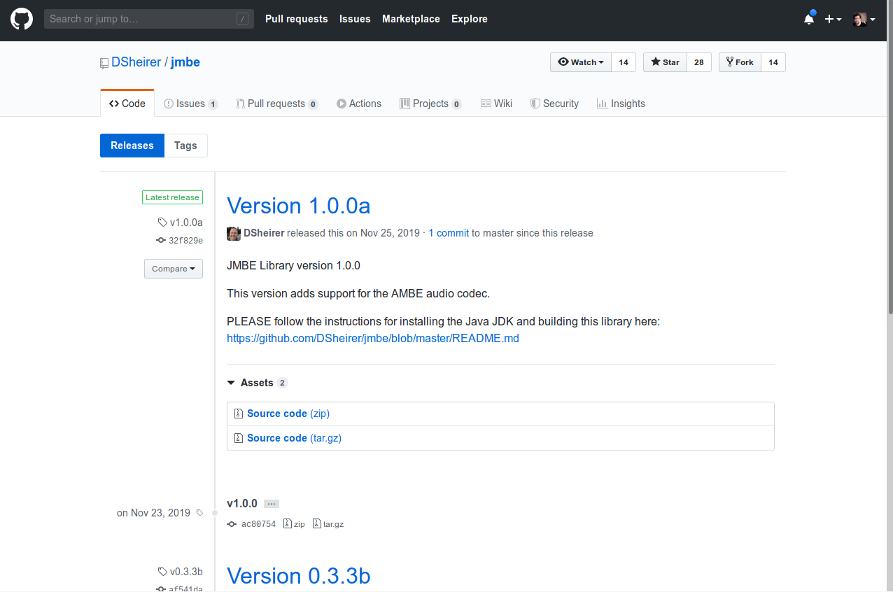
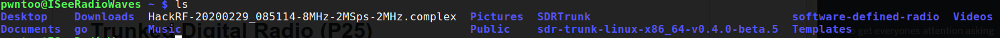

# Trunked Digital Radio (P25)

## Requirements

**Hardware**
- 2x RTL-SDR Receiver (1 is fine however 2 will give the best performance)

**Software**
- [SDRTrunk](https://github.com/DSheirer/sdrtrunk)
- [JMBE](https://github.com/DSheirer/jmbe) (used for decoding the audio)

## Steps

**Installation** 
First download the latest version of SDRTrunk from the [releases](https://github.com/DSheirer/sdrtrunk/releases) page on there GitHub, at the time this was 0.4.0 Beta 5.

Next we need the JMBE library so we can decode the audio and hear what people are saying, this is a bit more complicated because a binary isn't provided, however the installation uses Gradle and they have good documentation.

You can install it using the [instructions](https://github.com/DSheirer/jmbe/blob/master/README.md) on the JMBE Wiki and when you are done you should have a file (in your build directory) `codec\build\libs\jmbe-1.0.0.jar`, you can store this anywheres because you set it's location in SDRTrunk however I personally like to store it in the libs folder of the SDRTrunk source (`sdr-trunk-linux-x86_64-v0.4.0-beta.5/lib`).

**Configuration**

*Optional*
The first time you run SDRTrunk it will create a folder to store it's presets and settings located in your home folder ('~/SDRTrunk/`), I've shared my copy which includes the frequencies and call groups for most of HRM, if you would like to use this just download it and place it in your home folder. [SDRTrunk.tar.gz](../resources/SDRTrunk.tar.gz)

*Important*
This step is important because if you miss it you will see the active talk groups however be unable to listen. Open SDRTrunk (using the sdrtrunk file in the bin folder) and then open preverences via the view menu. Select the "JMBE Audio Decoder" menu option on the left and then tell SDRTrunk where your jmbe-1.0.0.jar is located.

**Usage**
You can use SDRTrunk with a single radio however the way trunked radio works is with a specific center frequency that handles all the metadata of talk groups, so with two radios you will have a better experience and be able to monitor more talk groups and even multiple radio systems. 

*Important*
It is important to note that this will not work with encrypted communication, in my area that is mostly only used by police however some cities are starting to use it for all communications. In my config I've labeled everything that would be encrypted and then configured SDRTrunk to not play the audio for them, I see them in my list of active talk groups but nothing else. 

## References
- [SDRTrunk](https://github.com/DSheirer/sdrtrunk)
- [JMBE](https://github.com/DSheirer/jmbe)
- [SDRTrunk Setup and Use Tutorial - rtl-sdr.com](https://www.rtl-sdr.com/sdrtrunk-setup-and-use-tutorial/)

## License 
This tool is protected by the GNU General Public License v2.
