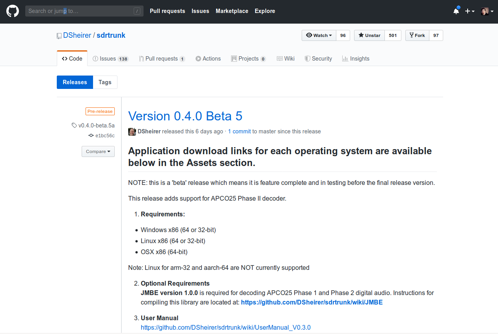

# Trunked Digital Radio (P25)

## Requirements

**Hardware**
- 2x RTL-SDR Receiver (1 is fine however 2 will give the best performance)

**Software**
- [SDRTrunk](https://github.com/DSheirer/sdrtrunk)
- [JMBE](https://github.com/DSheirer/jmbe) (used for decoding the audio)

## Steps

Install the latest version of SDRTrunk from the [releases](https://github.com/DSheirer/sdrtrunk/releases) page on there GitHub, at the time this was 0.4.0 Beta 5

## References
- [SDRTrunk](https://github.com/DSheirer/sdrtrunk)
- [JMBE](https://github.com/DSheirer/jmbe)
- [SDRTrunk Setup and Use Tutorial - rtl-sdr.com](https://www.rtl-sdr.com/sdrtrunk-setup-and-use-tutorial/)

## License 
This tool is protected by the GNU General Public License v2.
