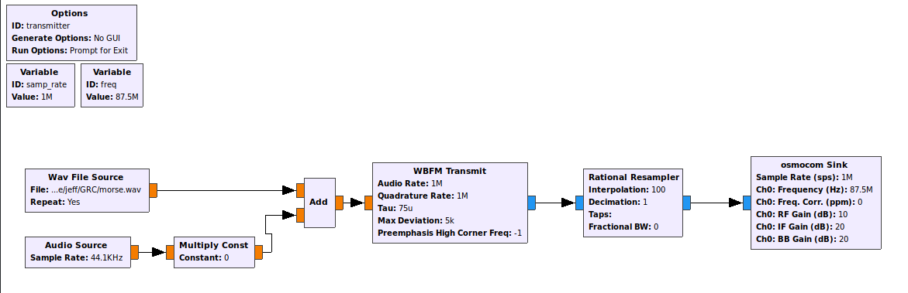
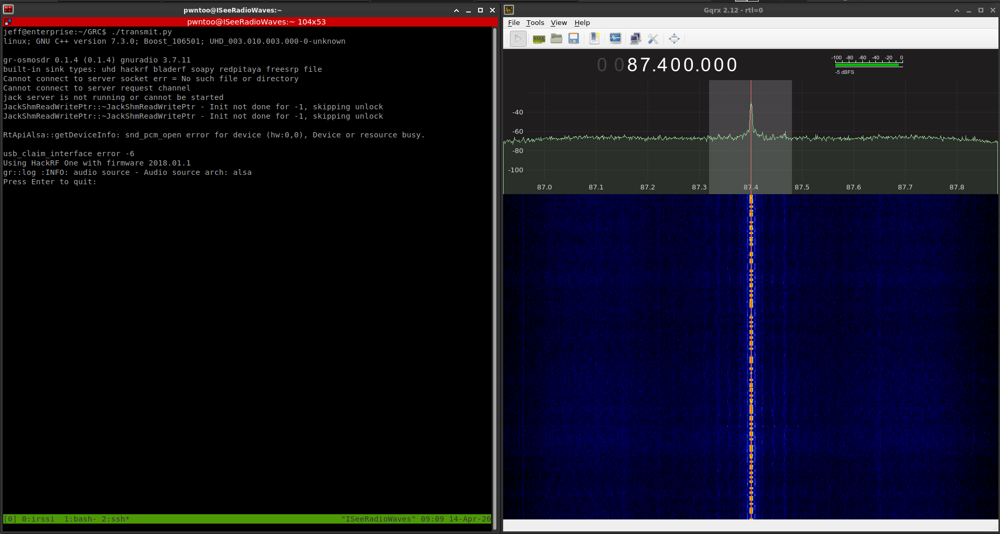

# Trasmitting FM

## Warning

Only do this on bands that are unlicensed or you have a license for, additionally be careful not to cause interfearance by transmitting too high. I was under 1w when I did this and monitored that the frequency range in I chose was not in use within range of me.

## Requirements

- An SDR that can transmit
- [GNURadio](https://www.gnuradio.org/)
- *Optional* [GNURadio Companion](https://wiki.gnuradio.org/index.php/GNURadioCompanion)

## Resources

- [grc workflow](../resources/transmit.grc)
- [generated python source](../resources/transmit.py)
- [sample audio file](../resources/morse.wav)

## GRC Workflow

## In Use

