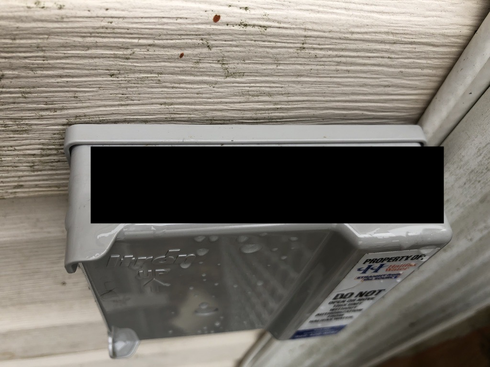
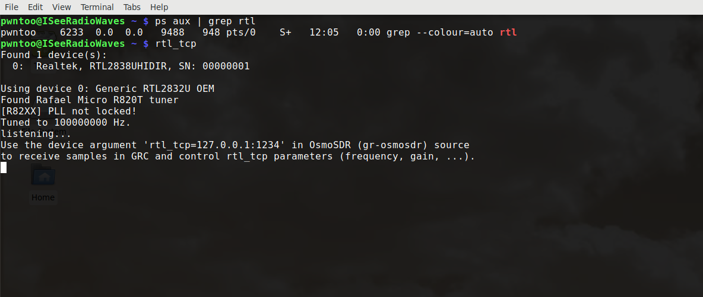
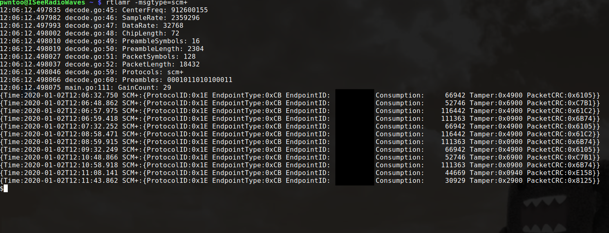

# Water Meters

## Requirements

**Hardware**
- RTL-SDR Receiver

**Software**
- rtl_tcp
- rtlamr

## Steps

### Finding your ID
On the side of your house is a box from the water company, on this is a ID. As you can see mine is \[redacted\].

### Setup
Run the following, this enables local TCP access to the RTL-SDR dongle:

`$ rtl_tcp`

### Test you can see data
In a new window run the following:

`$ rtlamr -msgtype=scm+`

_Note: scm+ is the type used by the devices Halifax Water installs, different locations may be different_

### Listen for your meter
Apply a filter with your ID

`$rtlamr -msgtype=scm+ -filterid=[redacted]`

## References
- [https://hackaday.com/2014/02/25/using-sdr-to-read-your-smart-meter/](https://hackaday.com/2014/02/25/using-sdr-to-read-your-smart-meter/)
- [https://github.com/bemasher/rtlamr](https://github.com/bemasher/rtlamr)

## License 
This tool is protected by the GNU General Public License v2.